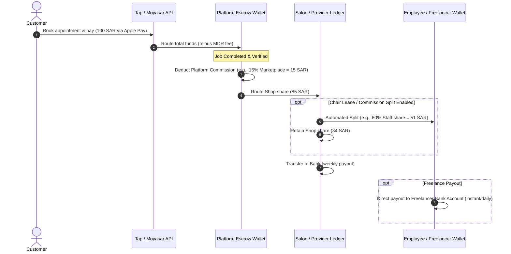

# Revenue & Business Model (Marketplace Connect)

Our business model is designed as a hybrid **SaaS + Marketplace Transactional** engine. This ensures low barriers to entry for providers while maximizing monetizable touchpoints as they scale.

---

## 1. Revenue Streams

### A. Marketplace Commission (Client Acquisition Fee)
* **First-Time Booking**: A **15% commission** is charged on bookings made by clients who discovered the provider via our marketplace.
* **Repeat Bookings**: To prevent back-channeling (taking clients offline), the commission drops to **5%** for subsequent bookings made through the app by the same client.
* **Direct Bookings (0% Fee)**: Bookings made by clients using the provider’s direct booking link (shared on Instagram, WhatsApp, website) incur **no commission** (only standard payment gateway processing fees).

### B. SaaS Subscription Tiers (Salons / Barber Shops)
While independent freelancers can use a basic version for free, brick-and-mortar shops require advanced CRM features.

* **Basic Plan (Free)**: Single branch, up to 2 employees, basic calendar, manual cash/card payments.
* **Growth Plan (189 SAR/month)**: Single branch, up to 5 employees, automatic WhatsApp reminders, loyalty program, basic reports.
* **Pro Plan (379 SAR/month)**: Unlimited branches, unlimited employees, resource mapping, automated commission/payroll calculator, advanced marketing push campaigns, API access.

### C. Chair-Leasing Fee Split
Salons that lease chairs/booths to freelance stylists pay a **2.5% transaction split routing fee** on all chair-leased bookings, which covers ledger splitting, automated payout management, and calendar coordination.

### D. Financial Transaction Fees (Standard MDR)
For online payments (Mada, Apple Pay, Visa/MC, STC Pay) processed via our gateway:
* **Mada**: 1.0% + 0.25 SAR per transaction (local debit card, highest volume).
* **Apple Pay & Visa/MC**: 2.2% + 1.00 SAR per transaction.
* **STC Pay**: 1.7% + 0.50 SAR per transaction.

---

## 2. Platform Transaction Cashflow

The following flow chart illustrates how funds flow from customer booking to final provider payout:

---

## 3. Marketplace Dynamics (Self-Sustaining Loop)

To prevent churn and secure transactions:
1. **No-Show Deposits**: Providers can mandate a **20% to 100% deposit** for high-value bookings or clients with a history of cancellations. The deposit is held in escrow and released to the provider if the client fails to show up within the cancellation window.
2. **Loyalty Program**: Marketplace-wide points system. Customers earn points on every completed booking, redeemable for discounts at any participating salon (reimbursed by the platform as marketing expense).
3. **Smart Pricing**: Dynamic peak-hour pricing suggestions are offered to shops to increase average order values (AOV) by 15-20% during weekends.
