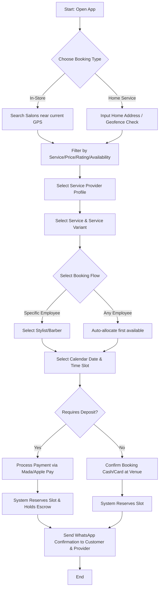
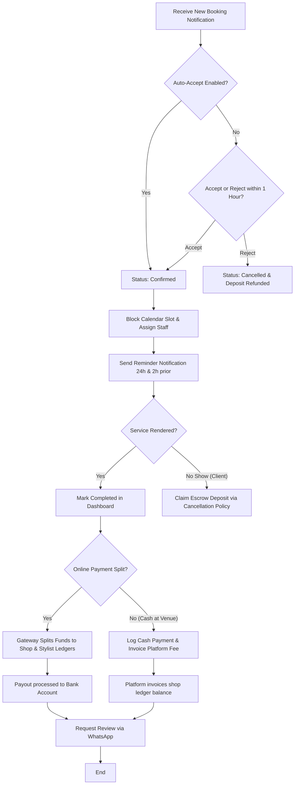

# Customer Journey Maps & User Flows

This document visualizes the step-by-step experience of both consumers and service providers, showing how they interact with the platform.

---

## 1. Customer Journey Map (Noura: Booking Home Beauty Service)

| Phase | 1. Discovery | 2. Evaluation | 3. Booking | 4. Delivery | 5. Post-Service |
| :--- | :--- | :--- | :--- | :--- | :--- |
| **Actions** | Searches for "Nail Tech Home Service" in Al-Malqa. | Browses profiles, checks portfolios, reviews ratings and pricing. | Selects date/time, inputs address, pays 50 SAR deposit via Apple Pay. | Stylist arrives at home on time, performs nail manicure. | Receives WhatsApp invoice, leaves 5-star rating and tip. |
| **Thoughts** | "Is there a platform that has actual slots instead of Instagram DMs?" | "This freelancer has great nail-art photos and 4.8 stars. The price is clear." | "Apple Pay worked instantly. Booking is confirmed. Booking details are on WhatsApp." | "The stylist was punctual and professional. The dynamic travel calculation worked." | "I can re-book her easily. I also earned 10 loyalty points for next time." |
| **Pain Points** | Hard to find freelancers with real portfolios. | Worried if portfolio photos are stolen or fake. | Afraid freelancer might cancel last minute and take deposit. | Traffic delay in Riyadh causing late arrival. | Forgetting to leave a review or losing booking history. |
| **Platform Solution** | Localized search and geofencing filter. | Verified customer reviews and watermarked photos. | Escrow deposits and secure payment refunds on cancellations. | Real-time map tracking and dynamic traffic routing buffers. | Automatic WhatsApp review prompt and easy "Book Again" button. |

---

## 2. Customer Search & Booking User Flow

The following Mermaid diagram maps the decision paths a client takes from landing on the app to booking confirmation:

---

## 3. Provider Order Fulfillment User Flow

The following Mermaid diagram maps how a provider handles a booking from receipt to payout:

