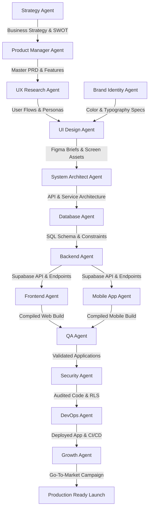

# AI Agent Workflow & Handover System

This document outlines the sequential execution pipeline, approval gates, and inputs/outputs for all agents in the development lifecycle.

---

## 1. AI Agent Execution Workflow

The project progresses from business concept to production-ready deployment via a structured, sequential handoff system:

---

## 2. Handover Specifications

For each phase, the incoming agent requires specific inputs, produces structured outputs, and must pass a manual review gate before invoking the next agent:

### Phase A: Business & Product Definition
* **Handover from Strategy to Product Manager**:
  - *Inputs*: Market research, SWOT details, revenue models.
  - *Outputs*: Master PRD, prioritized MoSCoW features, epic definitions.
  - *Reviewer*: User (Co-founder sign-off).
  - *Next Recipient*: UX Research Agent.

### Phase B: UX & Design System
* **Handover from UX Research & Brand to UI Design**:
  - *Inputs*: User personas, customer journeys, color tokens, typography guides.
  - *Outputs*: Screen maps, component specs, Figma-ready UI wireframes.
  - *Reviewer*: Product Manager Agent & User.
  - *Next Recipient*: System Architect Agent.

### Phase C: Technical Mapping
* **Handover from Database to Backend / Developers**:
  - *Inputs*: API specs, ERD layouts, system architecture maps.
  - *Outputs*: DDL SQL schema scripts, RLS policies, indexing scripts.
  - *Reviewer*: Lead System Architect Agent.
  - *Next Recipient*: Backend Agent, Frontend Agent, and Mobile App Agent.

### Phase D: QA & Launch Gate
* **Handover from QA to DevOps / Growth**:
  - *Inputs*: Built source code, environment templates, test cases.
  - *Outputs*: Code quality reviews, penetration/security audits, passing test reports.
  - *Reviewer*: User & Lead QA Agent.
  - *Next Recipient*: DevOps Agent (for production merge) & Growth Agent (for campaign launch).
